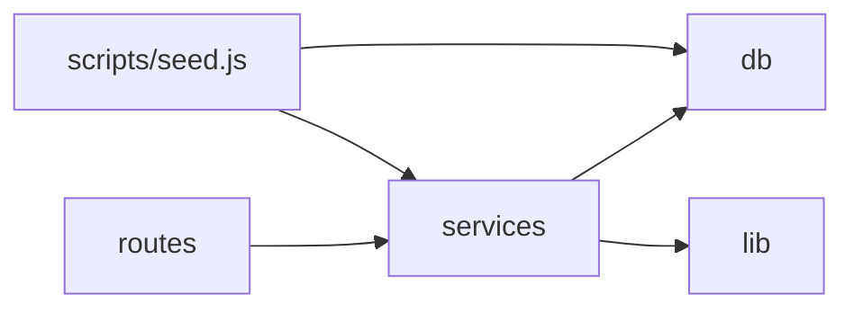

# HF2 Customer Distance REST Service — Architecture Overview

A short walkthrough of `ARCHITECTURE-SPINE.md` for anyone reviewing the design before code lands. The spine is the binding contract; this doc explains it.

## What this is

A small offline REST service: seed 15 customers from JSON, geocode them against a bundled reference file, then serve a count endpoint and a distance-ranked list endpoint. No auth, no writes beyond seeding, no external network calls at runtime.

## Shape

Three layers, one direction: **routes** parse HTTP and shape JSON; **services** hold the actual logic; **db** is the only place that touches Postgres. A `lib/` folder sits beside them for pure, dependency-free logic — the haversine formula and city-name normalization — so both are directly unit-testable without spinning up a server or a database.

The seed step (`scripts/seed.js`) is a separate, manually-run process, not something the server does on startup. That keeps "does the server start fast" and "did the seed run correctly" independently verifiable.

## The 10 decisions that matter

| # | Decision | Why it's fixed here |
| --- | --- | --- |
| AD-1 | Node.js + Express + `pg`, no ORM | Three endpoints and one seed script don't justify an ORM; keeps commits reviewable. |
| AD-2 | Seed is a standalone script, not seed-on-boot | Server startup shouldn't depend on seed idempotency logic. |
| AD-3 | Migrations via `node-pg-migrate` | One tracked source of truth for schema state, no hand-run DDL. |
| AD-4 | Idempotency is a DB `UNIQUE` constraint, not app logic | The database rejects duplicates regardless of how the seed script evolves. |
| AD-5 | Haversine is a pure, dependency-free function; `null` in → `null` out | Makes the 3 required unit tests trivial, and removes ambiguity about how null coordinates propagate. |
| AD-6 | City-name normalization has exactly one owner | One accent/case/whitespace-insensitive matcher, not two slightly different ones. |
| AD-7 | One config module owns `DATABASE_URL` and `PORT` | Seed script and server can't drift onto different env var names. |
| AD-8 | Tests run on Node's built-in `node:test` | Zero added dependency for 3 unit tests. |
| AD-9 | Response payload shapes and numeric coercion are pinned exactly | Without this, two compliant builds could still emit different JSON (e.g. `count` as a string vs a number). |
| AD-10 | Offline-only is enforced at the dependency level | No geocoding API client or LLM SDK is ever added, not just "none exists yet." |

## What's deliberately left open

Deployment/hosting, connection-pool tuning, and the optional Postgres MCP wiring aren't fixed — none of the three capabilities or the success signal requires them, and pinning them now would just be architecture theater. See the spine's **Deferred** section for the full list and reasoning.

## Verified versions (as of 2026-07-14)

Node.js 24 (LTS), Express 5.2.1, `pg` 8.22.0, `node-pg-migrate` 8.0.x (confirm exact patch on npmjs.com at install — sources disagreed on the last digit).

## Review trail

Four independent subagent passes ran against the spine before this was finalized: a reconciliation check against `SPEC.md`, a rubric walk of the good-spine checklist, a version-verification lens, and an adversarial divergence-attack lens. Full reports are in `reviews/`. All findings were resolved directly in the spine (see AD-9, AD-10, and the extensions to AD-5/AD-7).
