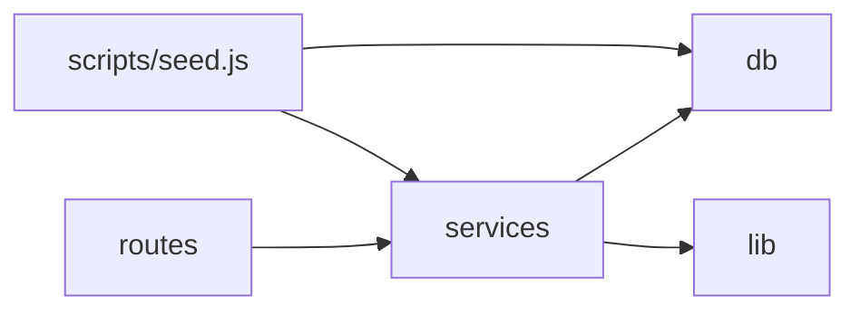
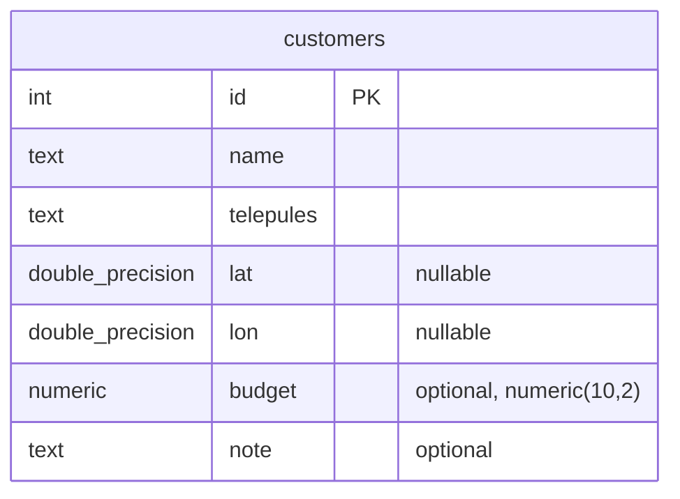

# Architecture Spine — HF2 Customer Distance REST Service

## Design Paradigm

Layered: **routes → services → data access**, one direction only.

- `routes/` — HTTP concerns only (parse request, call a service, shape the JSON response). No SQL, no business logic.
- `services/` — the two capabilities' logic (counting, distance ranking) and the seed/geocode workflow. No `req`/`res` objects reach this layer.
- `db/` — all `pg` calls and the connection pool. Nothing outside this layer issues SQL.

A pure `lib/` sits beside the layers for logic with zero I/O (haversine, city-name normalization) — not a layer itself, but importable from `services/` and directly from tests.



## Invariants & Rules

### AD-1 — Stack: Node.js + Express + `pg`, no ORM [ADOPTED]

- **Binds:** all
- **Prevents:** two units picking incompatible query layers (raw SQL vs an ORM) or incompatible migration tooling.
- **Rule:** all Postgres access goes through `pg` with hand-written SQL. No ORM/query-builder dependency is added.

### AD-2 — Seed/geocode is a separate process from the API server [ADOPTED]

- **Binds:** CAP-1 vs CAP-2/CAP-3
- **Prevents:** server startup time coupling to seed idempotency checks, and seed logic leaking into request-handling code paths.
- **Rule:** `scripts/seed.js` is a standalone entrypoint (`npm run seed`), invoked manually or by the documented command sequence. The server (`src/server.js`) never seeds on boot and has no code path that writes to `customers`.

### AD-3 — Migrations via `node-pg-migrate` [ADOPTED]

- **Binds:** CAP-1 (schema)
- **Prevents:** schema drift between environments and undocumented, ad-hoc DDL changes.
- **Rule:** every schema change is a `node-pg-migrate` migration file under `migrations/`; the migrations table is the single source of truth for applied schema state. No manual `psql` DDL outside a migration.

### AD-4 — Idempotency is a DB-level constraint, not application logic [ADOPTED]

- **Binds:** CAP-1
- **Prevents:** duplicate rows on re-run depending on the seed script's own check-then-insert logic (race- and refactor-fragile).
- **Rule:** `customers` carries a `UNIQUE (name, telepules)` constraint; the seed inserts via `INSERT ... ON CONFLICT (name, telepules) DO NOTHING`. The database itself rejects the duplicate, independent of how the seed script is written.

### AD-5 — Haversine calculation is a pure, dependency-free module [ADOPTED]

- **Binds:** CAP-3, the haversine unit-test constraint
- **Prevents:** the calculation being inlined into a route/service where it can only be exercised through an HTTP call, not a unit test.
- **Rule:** `lib/haversine.js` exports a pure function `(lat1, lon1, lat2, lon2) => km`, importing nothing beyond the standard library. The 3 required unit tests (Budapest–Vienna ≈214 km, 0 km self-distance, null-coordinate handling) import this module directly, not through the API. Contract: any `null` coordinate argument returns `null` (never `NaN`, never throws) — `services/customerService.js` relies on this to produce CAP-3's `distanceKm: null` without its own null-check duplicating the one inside the function.

### AD-6 — City-name normalization is one function, one owner [ADOPTED]

- **Binds:** CAP-1
- **Prevents:** two slightly different normalization implementations (accent-folding, whitespace-trim, Budapest-district handling) if geocoding logic is ever touched in more than one place.
- **Rule:** `lib/normalizeCity.js` exports the single accent/case/whitespace-insensitive normalization used to match seed cities against `reference/city-coordinates.json`'s `normalizedCity` field, including the Budapest-district special-case. Only `services/seedService.js` calls it.

### AD-7 — One config module owns the DB connection string [ADOPTED]

- **Binds:** CAP-1, CAP-2, CAP-3
- **Prevents:** the seed script and the server each assembling their own connection string or inventing different env var names.
- **Rule:** `src/db/pool.js` reads `DATABASE_URL` once and exports the shared `pg.Pool`. Both `scripts/seed.js` and `src/server.js` import this module; neither reads `process.env` for DB config directly. `src/server.js` separately reads `PORT` (default `3000`) — the only other env var this service has; no other module reads it.

### AD-8 — Test runner is Node's built-in `node:test` [ADOPTED]

- **Binds:** the haversine unit-test constraint
- **Prevents:** adding a test-framework dependency for what the spec requires as 3 unit tests.
- **Rule:** tests run via `node --test`; no Jest/Mocha/Vitest dependency is introduced.

### AD-9 — Response payload shapes are fixed exactly, with explicit numeric coercion [ADOPTED]

- **Binds:** CAP-2, CAP-3
- **Prevents:** one build echoing raw `pg` driver types (stringified `COUNT`/`NUMERIC` results) or raw snake_case columns, another normalizing them — two spec-compliant builds emitting different JSON for the same data.
- **Rule:** `services/customerService.js` is the only place that shapes response payloads, and returns:
  - `count(): Promise<number>` — the `pg` result's `count` column (returned by driver as a string) is coerced with `Number(...)` before it leaves the service; `routes/customers.js` emits `{"count": <that number>}` verbatim.
  - `byDistance(): Promise<Array<{id, name, telepules, budget, note, distanceKm}>>` — exactly these six camelCase keys per item, in this order; `lat`/`lon` are not included in the response (they're inputs to `distanceKm`, not part of the contract). `budget`/`note` pass through as stored (`null` if absent). `distanceKm` is a `number` rounded to 1 decimal or JSON `null`, never a string.

### AD-10 — Offline-only is enforced at the dependency level, not just by omission [ADOPTED]

- **Binds:** all (repeats SPEC's offline constraint and non-goals so it survives past this document)
- **Prevents:** a later change quietly adding a geocoding API client or an LLM SDK as a dependency, satisfying no single AD directly but violating the spec's core constraint.
- **Rule:** `package.json` carries no HTTP-client-to-external-service dependency and no LLM/AI SDK dependency. The only network call any part of this service makes is to the local Postgres instance. Geocoding is exclusively `lib/normalizeCity.js` matching against the bundled `reference/city-coordinates.json`.

## Consistency Conventions

| Concern | Convention |
| --- | --- |
| Naming (files, modules) | camelCase filenames for JS modules (`seedService.js`), kebab-case for scripts invoked via npm (`npm run seed`). Table/column names: `snake_case` (Postgres convention) — `telepules`, `lat`, `lon`. |
| Data & formats | Response bodies are plain JSON, no envelope/wrapper (matches SPEC's exact shapes: `{"count": N}`, and a bare array for `/customers/by-distance`, both per AD-9). |
| State & cross-cutting | All writes to `customers` happen only in `scripts/seed.js` via `services/seedService.js`. Logging is `console.warn`/`console.error` to stdout/stderr (no logging library — matches the minimal-dependency stance); a city-matching miss logs a warning and continues, never throws. |
| Errors | An unhandled route/DB error responds `500` with body `{"error": "internal error"}` (fixed minimal JSON shape, no stack trace leaked to the client); the actual error is logged server-side via `console.error`. |
| npm scripts | `package.json` fixes exactly these script names, since the README's documented command sequence depends on them: `migrate` (runs `node-pg-migrate up`), `seed` (runs `scripts/seed.js`), `start` (runs `src/server.js`), `test` (runs `node --test`). |

## Stack

| Name | Version |
| --- | --- |
| Node.js | 24 (current LTS) |
| Express | 5.2.1 |
| pg (node-postgres) | 8.22.0 |
| node-pg-migrate | 8.0.x (verify exact patch on npmjs.com at install time — sources disagreed on 8.0.3 vs 8.0.4) |
| Postgres | 16+ (any version node-pg-migrate/pg support; not otherwise pinned by a capability) |
| Test runner | `node:test` (built-in, no package) |

## Structural Seed

```text
hf2-customer-distance-service/
  src/
    server.js          # Express app bootstrap; wires routes, starts listening
    db/
      pool.js           # AD-7: shared pg.Pool from DATABASE_URL
    routes/
      customers.js      # GET /customers/count, GET /customers/by-distance
    services/
      customerService.js  # count + by-distance query/ranking logic
      seedService.js       # seed/geocode workflow (AD-2, AD-6); only writer of `customers`
    lib/
      haversine.js       # AD-5: pure distance function
      normalizeCity.js    # AD-6: pure normalization function
  scripts/
    seed.js              # AD-2: standalone seed entrypoint, calls seedService
  migrations/
    ...                  # AD-3: node-pg-migrate migration files
  reference/
    city-coordinates.json  # bundled geocoding reference (existing)
  seed-customers.json    # source seed data (existing)
  test/
    haversine.test.js    # AD-5/AD-8: the 3 required unit tests
  README.md              # must cover, in order: start Postgres, run migration, seed, start server, run tests
```



Natural key for AD-4's uniqueness constraint: `(name, telepules)` — the seed data has no external customer id, and this pair is what CAP-1 says must not duplicate across re-runs.

## Capability → Architecture Map

| Capability | Lives in | Governed by |
| --- | --- | --- |
| CAP-1 (idempotent seed + geocode) | `scripts/seed.js`, `services/seedService.js`, `lib/normalizeCity.js`, `migrations/` | AD-2, AD-3, AD-4, AD-6, AD-7 |
| CAP-2 (`GET /customers/count`) | `routes/customers.js`, `services/customerService.js` | AD-1, AD-7, AD-9, paradigm (routes→services→db) |
| CAP-3 (`GET /customers/by-distance`) | `routes/customers.js`, `services/customerService.js`, `lib/haversine.js` | AD-1, AD-5, AD-7, AD-9, paradigm |

## Deferred

- **Commit granularity / delivery process** ("small, focused commits so the build process itself is inspectable") — a delivery-process constraint, not a structural one; intentionally not an AD since no two builders could diverge on it in a way that shows up in the running system. Acknowledged here so it isn't lost: applies to whoever executes the build.
- **Authentication/authorization** — explicit non-goal in SPEC; no AD needed unless that changes.
- **API framework upgrade path / versioning** — out of scope; this is a fixed benchmark service, not a service expected to evolve past its 3 capabilities.
- **Connection pooling tuning, retry/backoff policy** — not exercised by any capability or success signal; left to `pg.Pool` defaults until a real load profile exists.
- **Postgres MCP wiring for dev-time schema/data visibility** — SPEC marks this optional ("if a tool for it is available"); not part of this spine, added only if the environment already provides the tool.
- **Deployment/environment topology (containerization, CI, hosting)** — SPEC's success signal is a local documented command sequence (start Postgres, migrate, seed, start server, run tests); no deployment target is specified, so none is fixed here.
